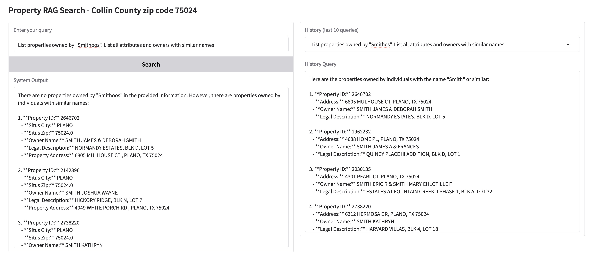

# Sample Property Search App

## Description
The repo contains sample App to demonstrate RAG application for property search.
The repo contains example data, as well as all code to create LlamaIndex store and Vector index to search by owner name and property legal description.

## Index Creation
The App is using basic LlamaIndex functionality to create and persist Embeddings Index and Document store.

## Installation

1. Clone the repository:
    ```sh
    git clone <repository-url>
    cd <repository-directory>
    ```

2. Create a virtual environment and activate it:
    ```sh
    python -m venv venv
    source venv/bin/activate  # On Windows use `venv\Scripts\activate`
    ```

3. Install the required dependencies:
    ```sh
    pip install -r requirements.txt
    ```

## Usage

1. Set up the environment variables:
    Create a `.env` file in the root directory and add the necessary environment variables as shown in the provided [env_example](env_example) file.

2. Index Creation
   The App is using basic LlamaIndex functionality to create and persist Embeddings Index and Document store.
    ```sh
    python app/indexes/build_index.py
    ```


3. Run the application:
    ```sh
    python app/run_app.py
    ```


The application will run at the [following URL](http://127.0.0.1:7860) . Public URL will be provided by Gradio, valid for 72 hours, the URL will be displayed once App has started.

Example query and history query screenshot:



## Index Creation
The App is using basic LlamaIndex functionality to create and persist Embeddings Index and Document store.
The App supports running local HuggingFac embedding models or using OpenAI embedding model. 

## Create Index Job
To create the index, you can run the "create index" job using the following command:
```sh
python app/indexes/build_index.py
```

## Notebooks

The repository contains several Jupyter notebooks for different purposes:

- `search-playground.ipynb`: Demonstrates how to instantiate and use the document store and vector index for property search.
- `Automerging_retriever_playground.ipynb`: Shows how to use the AutoMergingRetriever for retrieving property information.
- `search-playground-persist.ipynb`: Example of persisting the document store and vector index.

## Data

The [data] directory contains example property data used in the application. The [data_utils](http://_vscodecontentref_/7) directory contains scripts for converting CSV data to other formats.

## License

This project is licensed under the MIT License. See the LICENSE file for details.

## Acknowledgements

This project uses the following libraries and resources:
- [LlamaIndex](https://github.com/jerryjliu/llama_index)
- [OpenAI](https://openai.com/)
- [Collin County Property Data](https://taxpublic.collincountytx.gov/search)


